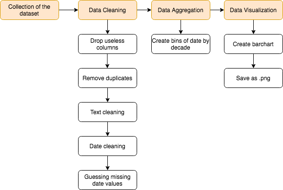

# MoMa data pipeline

The objective of this project is to build a pipeline for the dataset of the MoMa's collection. The pipeline cleans the data and generate a visualization based on a problem defined beforehand.

Original data set can be found [here](https://github.com/MuseumofModernArt/collection).

## Problem definition

I am working at the MoMa and I would like to create a new temporary exhibition of art works by decade. I have a limited capaity in the room I will use for that exhibition so I need to know the repartition of my art work by decade and manage the organization of this new project. 

**Q: What is the repartition of MoMa's collection by decade?**

## Process

**To reach the final output I need:**
* An accurate date of creation for each art work
* Minimumal accurate columns and data if further information are needed
* A new column Date Range to store the art work in bins by decade

**Steps used in the data pipeline:**

**Tools and way of working:** I first did data exploration in jupyter notebook in order to test functions and pandas concepts. Then I created functions for each step in a python file. 

## Python concepts used in the pipeline

Libraries used:
* pandas
* numpy
* regex
* matplot.lib
* searborn

Concepts used:
* `drop_duplicates()` and `drop()` functions to get off useless columns and rows
* regex `search()` to catch date values and clean it
* `apply()` to apply function to dataFrame
* `groupby()` & `agg()`
* `nunique()`, `value_counts()` and `isna()` to deal with value types
* `loc[]` and dealing with index and columns of dataFrames
* `fillna()` to fill the NaN value with the guessed ones
* pandas `.cut()` functions to create bins

## Results

By executing the python file `moma-pipeline.py` you will generate a `.png` visualization answering the question asked in the Problem definition part.

## Obstacles

* Went too far on my problem definition for the project. I needed to review it a little bit. 
* Needed to deal with data types depending on the function used (regex match or calculating mean of date) and NaN values where causing a lot of data type errors.
* Complicated the project by replacing the missing value by the mean of each Artist because I needed to match values between two different dataFrames.

## Lesson learned
 
* Numpy is needed to deal with `NaN` values
* We can pass several arguments in the function when using `apply()`
* Create copy of the dataframe for each new function applied when I was working on jupyter notebook to make the exploration easier
